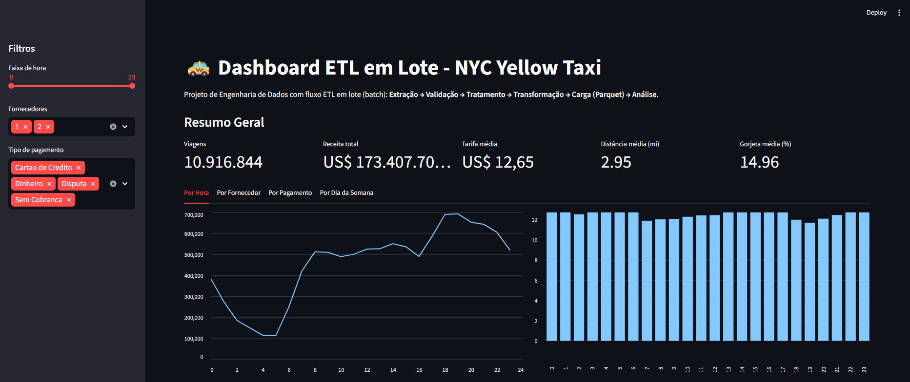
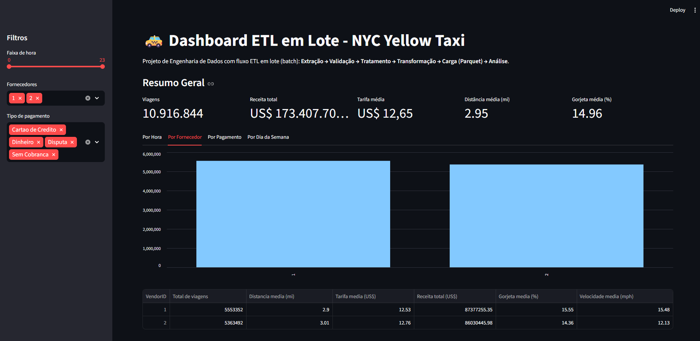
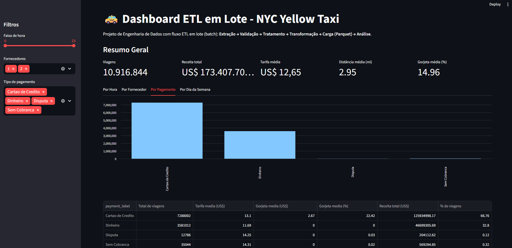
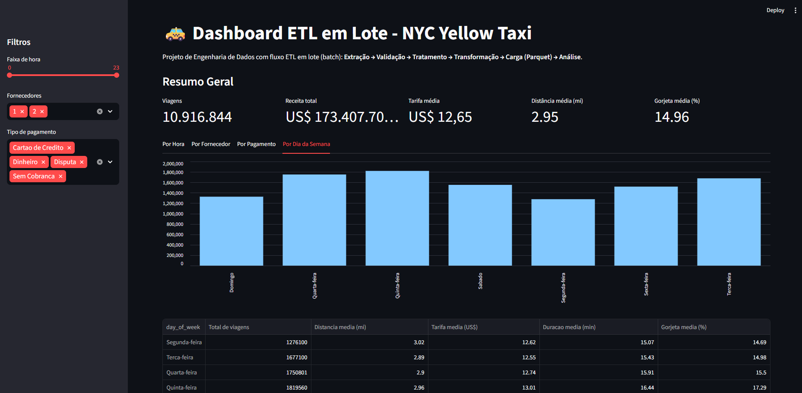

# Pipeline ETL em Batch - NYC Yellow Taxi


#### 🚕 Projeto de Engenharia de Dados com pipeline ETL em lote para dados de corridas de táxi de NYC, persistência em Parquet e dashboard interativo com Streamlit.

---

## Links Importantes

| Recurso | Link |
|--------|------|
| Instagram | [@thiagolima_14](https://www.instagram.com/thiagolima_14) |
| LinkedIn | [Thiago Lima](https://www.linkedin.com/in/thiagolima-14/) |

---


## Sobre o Projeto

Este repositório mostra um fluxo ETL completo em batch usando dados reais de Yellow Taxi de NYC.

O pipeline cobre as etapas de:

1. Extração dos dados CSV
2. Validação e tratamento de qualidade de dados
3. Transformação e criação de métricas
4. Agregações para análise
5. Persistência em formato Parquet
6. Visualização no Streamlit

---

## Arquitetura do Pipeline


---

## Dashboard

### Visão Geral



### Análise por Fornecedor



### Análise por Pagamento



### Análise por Dia da Semana



---

## Stack Tecnológica

| Camada | Tecnologia | Versão | Por que usamos |
|--------|------------|--------|----------------|
| Core | Python | 3.14+ | Linguagem principal para construir o ETL e o dashboard. |
| Core | Streamlit | 1.44+ | Cria o dashboard interativo rapidamente, sem precisar de front-end. |
| Biblioteca Python | pandas | 2.2+ | Faz limpeza, transformação, agregações e análise tabular dos dados. |
| Biblioteca Python | pyarrow | 19.0+ | Leitura e escrita de Parquet com boa performance em formato colunar. |
| Biblioteca Python | ipykernel | 7.2+ | Conecta o ambiente Python ao Jupyter Notebook. |
| Ferramenta | Jupyter Notebook | - | Desenvolvimento e validação passo a passo do pipeline ETL. |
| Ferramenta | UV | - | Gerencia dependências e execução do projeto de forma rápida e reprodutível. |

---

## Estrutura do Projeto

```text
├── data/
│   ├── yellow_tripdata_2016-03.csv
│   └── output/
│       └── yellow_taxi_2016-03.parquet
├── notebooks/
│   └── main.ipynb
├── dashboard.py
├── DATASET.md
├── pyproject.toml
└── uv.lock
```
